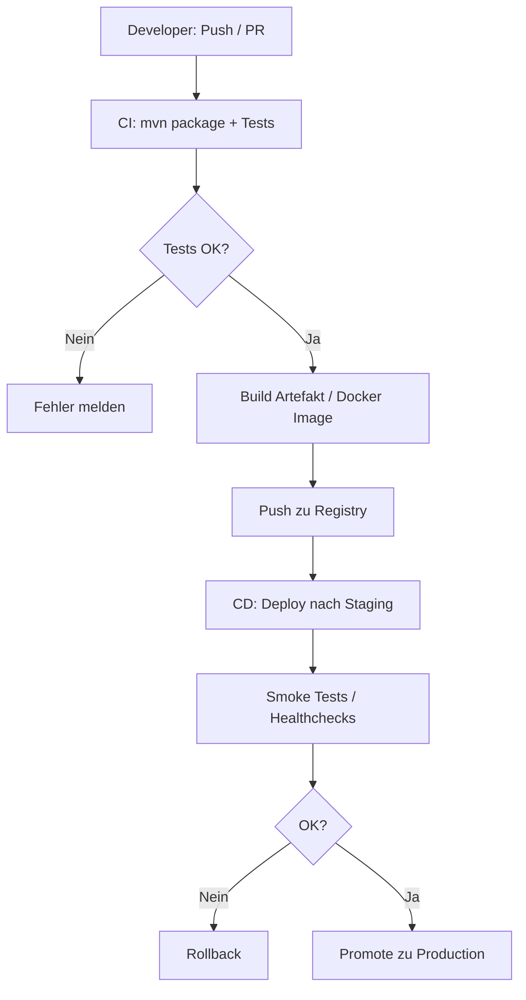

# Übung 2: CI/CD Pipeline – Team-Handout

## Einführung in CI/CD

### Was ist CI/CD – in 2 Sätzen

* Continuous Integration (CI): Jede Codeänderung wird automatisch geprüft – Build, Tests, Qualitätssicherung.
* Continuous Deployment (CD): Änderungen, die Tests bestehen, werden automatisch (oder halbautomatisch) auf einen Zielserver oder Cloud-Dienst ausgeliefert.

### CI und CD – Grundlagen

* CI (Continuous Integration): Codeänderungen werden regelmäßig (mehrmals täglich) in das zentrale Repository integriert und automatisch getestet.
* CD (Continuous Deployment/Delivery): Der geprüfte Code wird automatisch auf Test- oder Produktionsserver bereitgestellt.

### Vorteile für eVote

* Schnellere Entwicklung: Änderungen werden sofort geprüft und integriert.
* Weniger Integrationsprobleme: Konflikte im Code werden früh erkannt.
* Stabile Releases: Durch automatisierte Tests und Builds wird die Qualität jedes Updates gesichert.
* Transparenz im Team: Jeder sieht den aktuellen Stand und Build-Status.

### Automatische Tests & Builds

* Automatische Builds: Prüfen, ob der Code kompiliert und das Projekt lauffähig ist.
* Unit- und Integrationstests: Entdecken Logikfehler und unerwartetes Verhalten direkt nach dem Commit.
* Früherkennung von Fehlern: Probleme werden identifiziert, bevor sie in die Live-Version gelangen.
* Zeitersparnis: Weniger manuelle Prüfungen, mehr Fokus auf neue Features.


## Einrichtung der CI/CD-Pipeline

Für das Einrichten der CI/CD-Pipeline gibt es zwei Möglichkeiten:

* Manuell: Erstellung einer `.yml-Datei` mit definierten Schritten und Parametern.
* Automatisch: Nutzung von GitHub-Vorlagen (Presets) für Standart-Workflows.

Diese vordefinierten Workflow-Vorlagen können direkt genutzt oder angepasst werden. Basierend auf dem Code im Repository schlägt GitHub passende Presets vor (z.B. für Node.js Projekte). Diese Vorlagen erleichtern den Einstieg und decken verschiedene Bereiche ab.
Beispielsweise:

* CI bzw. Erstellen und Testen von Pull Requests
* Bereitstellung von Releases
* Automatisierungen (Labeln neuer Issues)
* Code-Überprüfungen
* CD bzw. Page-Deployment (GitHub Pages)

Workflows werden in YAML-Datein im Ordner `.github/workflows` definiert. Sie können automatisch durch Ereignisse, manuell oder zeitgesteuert ausgelöst werden. GitHub Actions dient dabei als Plattform für CI/CD, um Build-, Test- und Deployment-Prozesse zu automatisieren.

Für mehr Informationen kann die [GitHub-Dokumentation](https://docs.github.com/de/actions/get-started/quickstart) verwendet werden.

## Testing in CI/CD

In modernen **CI/CD-Prozessen** sind automatisierte Tests ein zentraler Bestandteil der Build-Pipeline. Sie stellen sicher, dass neuer Code nur dann integriert und bereitgestellt wird, wenn alle definierten Tests erfolgreich durchlaufen wurden. Dadurch wird die Codequalität gesichert und Fehler werden frühzeitig erkannt.

In unserem Projekt wird das Testen über Maven ausgeführt, das in der **`pom.xml`** konfiguriert ist. Maven ist ein Build-Management- und Projektautomatisierungstool, das Abhängigkeiten verwaltet, den Quellcode kompiliert und Tests ausführt.

User CI/CD-Workflow (`test-and-publish.yml`) enthält den zentralen Befehl:

```yaml
- name: Run tests and build
  run: mvn -B -DskipTests=false package
```

### Parametererklärung

- **`-B`** steht für *Batch Mode* und sorgt dafür, dass Maven ohne interaktive Eingaben ausgeführt wird – ideal für automatisierte, skriptgesteuerte Builds.
- **`-DskipTests=false`** stellt sicher, dass die Tests **nicht** übersprungen, sondern tatsächlich ausgeführt werden.


### Maven Build Lifecycle

Der Befehl `mvn package` liest die Konfigurationen aus der **`pom.xml`**, in der Compiler-, Test- und Plugin-Definitionen enthalten sind.  
Maven durchläuft dabei automatisch alle Phasen des standardisierten **Build-Lifecycles**:

| **Phase**      | **Beschreibung**                                                     |
| -------------- | -------------------------------------------------------------------- |
| `validate`     | prüft die Projektstruktur                                            |
| `compile`      | kompiliert den Quellcode aus `src/main/java`                         |
| `test-compile` | kompiliert den Testcode aus `src/test/java`                          |
| `test`         | führt automatisiert **JUnit 5 Tests** aus (über das Surefire Plugin) |


### Aufbau und Funktionsweise der Tests

Die **Testklasse** `AppTest.java` liegt unter `src/test/java` und überprüft mit **JUnit 5** die Funktionen der **Produktivklasse** `App.java`.  
Durch die Annotation `@Test` erkennt Maven automatisch, welche Methoden getestet werden sollen.

Beispielsweise wird geprüft, ob die Methode `greet()` den richtigen Standardtext zurückgibt, wenn kein Benutzername angegeben wird.

### Automatische Testausführung in der CI/CD-Pipeline

Sobald neuer Code gepusht wird, führt GitHub Actions automatisch mvn package aus, startet die Tests und bricht den Build ab, falls ein Test fehlschlägt. Nur bei „grünen“ Tests wird der nächste Schritt der Pipeline, das Bauen und Veröffentlichen der Seite, ausgeführt.

## CD / Deployment-Konzepte

## Deployment-Konzept

Continuous Deployment (CD) automatisiert den Prozess der Bereitstellung von Softwareänderungen in einer Produktionsumgebung. Es stellt sicher, dass nur getestete und geprüfte Änderungen live geschaltet werden, wodurch die Qualität und Stabilität der Anwendung gewährleistet wird. Als Beispiel haben wir vorerst eine Pipeline implementiert, die nach erfolgreichem Build und Test automatisch eine statische Website auf GitHub Pages veröffentlicht. Später könnte hier auch die dann weiterentwickelte eVote-Anwendung deployed werden.

### Vorübergehende Implementierung: Deployment auf GitHub Pages

Unser CD-Prozess (`test-and-publish.yml`) umfasst folgende Schritte:

1. **Build & Test**: `mvn -B -DskipTests=false package`
2. **Site-Generierung**: `mvn -B -DskipTests=false site jacoco:report`
3. **Verifikation**: Automatische Prüfung, ob `target/site/` erstellt wurde
4. **Content-Integration**: Kopieren der `uebungen/` in die generierte Site
5. **Deployment**: Automatische Veröffentlichung auf GitHub Pages

#### Was wird deployed?

* **Maven Site**: Projektdokumentation mit Dependencies, Plugins und Reports
* **JaCoCo Reports**: Test-Coverage-Berichte mit visueller Darstellung
* **Team-Übungen**: Markdown-Dateien werden direkt in die Site integriert
* **Statische Assets**: CSS, JavaScript und Bilder für die Website

#### CD-Pipeline Details

```yaml
publish:
  name: Publish site to GitHub Pages
  runs-on: ubuntu-latest
  needs: build
  if: github.event_name == 'push' && github.ref == 'refs/heads/main' && needs.build.result == 'success'
  steps:
    - name: Checkout
    uses: actions/checkout@v4

    - name: Set up JDK 25 (with Maven cache)
    uses: actions/setup-java@v4

    - name: Build site
    run: mvn -B -DskipTests=false site jacoco:report

    - name: Verify site and index
    run: ...

    - name: Copy uebungen into site
    run: ...

    - name: Ensure Pages serves static files (.nojekyll)
    run: ...

    - name: Publish site to GitHub Pages
    uses: peaceiris/actions-gh-pages@v4
    with:
        publish_dir: ./target/site
        publish_branch: gh-pages
```

**Merkmale der Pipeline:**

* **Gating**: Deployment erfolgt nur nach erfolgreichem Build und Tests
* **Branching**: Nur `main`-Branch löst Deployment aus
* **Automatisierung**: Vollautomatischer Prozess ohne manuelle Eingriffe
* **Validierung**: Prüfung der generierten Artefakte vor Deployment
* **Rollback-Fähigkeit**: Git-basiertes Versioning ermöglicht einfache Rollbacks

### Ausblick: Skalierung für Produktionsanwendungen

Für eine weiterentwickelte eVote-Anwendung würde sich eine Erweiterung der Pipeline in folgenden Bereichen empfehlen. Die Reihenfolge folgt dem logischen Fluss von der Anwendung zur Infrastruktur:

1. **Artifact & Container-Management** – Wie wird Code in reproduzierbare Artefakte verpackt?
    * Nutzung von Artefakt-Repositorys (z.B. Nexus, Artifactory) für JAR-Binaries
    * Docker-Images in Container-Registries (z.B. Docker Hub, GitHub Container Registry)
    * Versionierung und Signierung für Sicherheit und Nachverfolgbarkeit

2. **Multi-Environment-Strategie** – Wo und wie wird deployt?
    * `dev` → `staging` → `production` Pipeline mit separaten Konfigurationen
    * Konfigurationsmanagement pro Environment (Datenbanken, APIs, Secrets)
    * Automatische Promotion zwischen Environments nach Validierung

3. **Sichere & robuste Deployment-Strategien** – Wie wird sicher ausgerollt?
    * Blue-Green oder Canary-Deployments für Zero-Downtime-Updates
    * Healthchecks und Integrations-Tests vor vollständiger Freigabe
    * Automatische Rollback-Mechanismen bei Fehlern

4. **Orchestrierung & Infrastruktur** – Wie wird alles verwaltet und skaliert?
    * Kubernetes für automatische Skalierung und Ressourcenverwaltung
    * Infrastructure-as-Code (IaC) für reproduzierbare Deployments
    * docker-compose für lokale development-Setups und schnelle Iteration

#### Beispielhafte CI/CD-Pipeline



## Branching und Pull Requests in Verbindung mit CI/CD

Grundlegend Umsetzung mit:
- **main-Branch** für stabilen Projektstand
- **feature-Branches** für neue Funktionen

Änderungen werden über Pull Requests in main nach einem 4-Augen-Prinzip gemergt.

CI/CD-Integration erfolgt mit **GitHub Actions** und GitHub Actions führt bei jedem Push in einem Branch automatisch die Pipeline aus.
Erst wenn alle Checks erfolgreich sind, kann der Pull Request gemergt werden.
Zusätzlich wird beim Merge in main automatisch eine (Test-)Website erzeugt und über **GitHub Pages** veröffentlicht.
Der Status der Pipeline und der Tests ist unter Actions des Repositories sichtbar.
